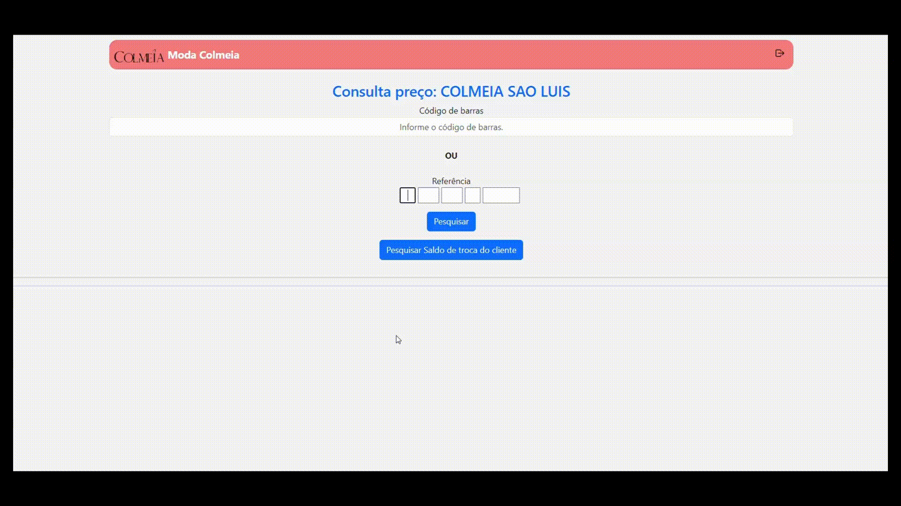

<h1 align="center">Consulta Preço</h1>

<h2 align="left">Sobre</h1>

Esta aplicação Laravel foi feita para fazer consultas de estoques de peças de roupas em múltiplas sedes em tempo real utilizando consultas em PL/SQL.

<h2 align="left">Pré-requisitos</h1>

- PHP>=8.2

- Oracle Instant Client 21.4 ou mais recente

- Laravel-OCI8 ([https://yajrabox.com/docs/laravel-oci8/12.0](https://github.com/yajra/laravel-oci8))

